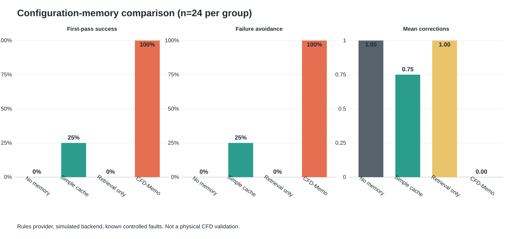

# 配置记忆正式对比实验结果

执行日期：2026-09-27。协议版本：1。实验包含 4 个对比组、4 个参数任务、2 类受控
配置故障和 3 次重复，共 96 个评估 episode。训练任务未计入指标，评估期间记忆冻结。

## 汇总结果

| 对比组 | 首轮成功率（95% Wilson CI） | 最终成功率 | 失败避免率（95% Wilson CI） | 平均修正次数 ± SD |
| --- | ---: | ---: | ---: | ---: |
| `no_memory` | 0% [0%, 13.8%] | 100% | 0% [0%, 13.8%] | 1.000 ± 0.000 |
| `simple_cache` | 25% [12.0%, 44.9%] | 100% | 25% [12.0%, 44.9%] | 0.750 ± 0.442 |
| `retrieval_only` | 0% [0%, 13.8%] | 100% | 0% [0%, 13.8%] | 1.000 ± 0.000 |
| `cfd_memo` | 100% [86.2%, 100%] | 100% | 100% [86.2%, 100%] | 0.000 ± 0.000 |

两类故障的组内结果一致：每组各包含 12 个 `missing-boundary` 和 12 个
`bad-transport` 任务。未提前避免的故障均被现有确定性 Validator 正确识别。

## 解释

- 最终成功率相同，说明四组在 2 次修正预算内都能完成；真正的差异是首次成功和修正成本。
- 简单缓存只对训练阶段保存的完全相同 Re=100 task 生效，因此命中 6/24。
- 仅检索组 24/24 引用了经验，但经验只进入 Reviewer，仍然需要一次事后修正。
- CFD-Memo 让经验进入 Planner 和 Case Writer，24/24 在首次 runner 检查前恢复已知漂移。

## 限制

本实验使用确定性规则模型、模拟后端和两类预先定义的已知故障。三次重复主要验证结果
可复现性，不包含大模型采样波动。Wilson 区间描述本固定任务集的二项比例，不能外推到
未知错误、新几何、新求解器或真实 CFD 任务总体。`physical_validated=false`；C6 的真实
OpenFOAM 物理验收是独立证据。

五条代表性决策路径见 [典型案例](memory-study-cases.md)。
